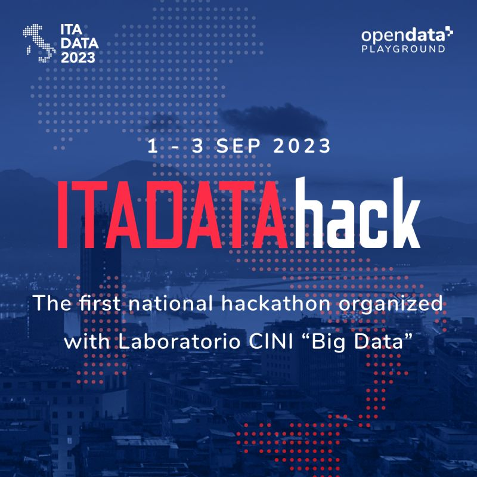
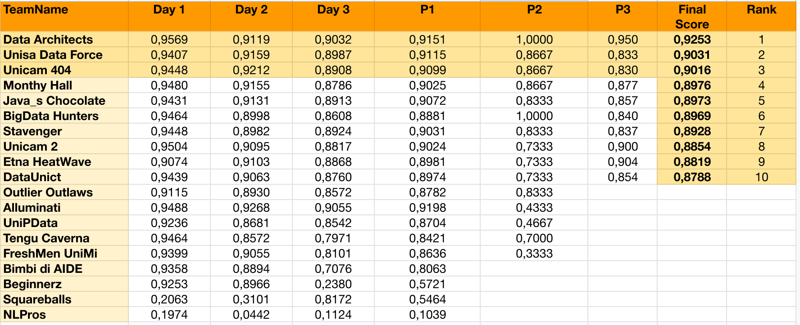

# ITADATAhack2023 - Team Monty Hall

## Introduction
This repository recounts the participation of our team, made up of data science students from the University of Perugia, at ITADATAhack 2023, a national event dedicated to innovation in the field of data. 

### How we prepared
Before the challenge, we prepared a repository containing a small set of functions for any eventuality. You can find the repository [here](https://github.com/Arcaici/NLP_toolkit)

  

## Challenges
The challenge was divided into three days, with increasing difficulty day after day. Each day a new challenge was starting but all challenges ended 24 hour after the begin of the third one.

### Day 1
During the first day of the competition we were presented with a balanced dataset (containing duplicates). Our goal was to address a multiclass problem with a single output, where the label corresponded to the single chapter of the law.

### Day 2
During the second day of the competition we were presented with an unbalanced data set. Our goal was to address a multiclass problem with a single output, where the label corresponded to both the chapter and the subchapter of the law, for a total of 87 labels.

### Day 3
During the third day of the competition we were presented with an unbalanced data set. Our goal was to address a multiclass problem with multiple outputs. Our task was to predict the possible pairs of chapter and subchapter to which the law belonged.

## Final Rank
DAY1, DAY2 and DAY3 are the scores obtained during the 3 days of hackathon. P1 is the average of the 3 days, P2 is the score assigned by the external commission and P3 is the score obtained with the our final presentation.

  

## Conclusion
Participating in ITADATAhack 2023 was a great experience that allowed us to learn about and improve some aspects of Data Science. We hope this README provides helpful insights into the approach our team uses! Please feel free to explore our code and results.
___
For further information, check [here](./Final_Presentation.pdf)
